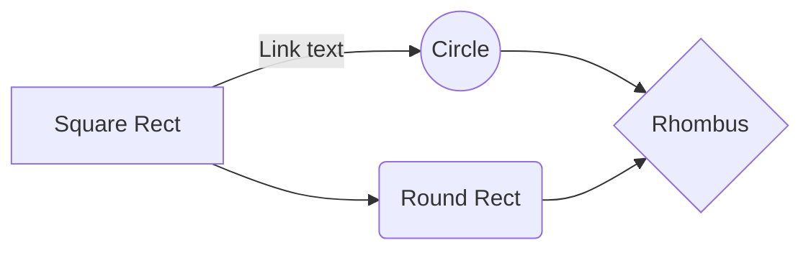

# Sobre mim

### Aruando profissionalmente com:
COS (Cache Object Script) e tecnologias **Intersystems**.

### Interessado por:
RUST (WebAssembly) e tecnologias web (JS - React, CSS, HTML)

```mermaid
graph LR
A[Square Rect] -- Link text --> B((Circle))
A --> C(Round Rect)
B --> D{Rhombus}
C --> D
```
